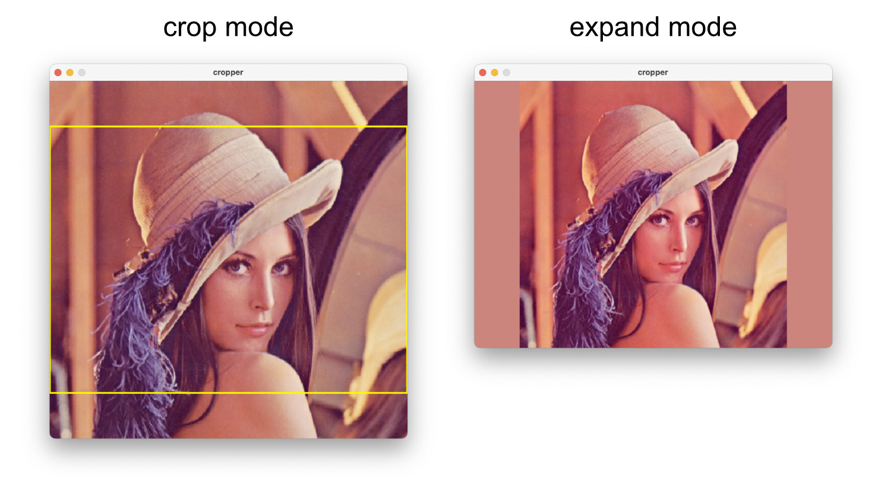

# inky-frame
This project contains a set of tools that can be used to display images on a [Pimoroni Inky Impression](https://shop.pimoroni.com/products/inky-impression) e-ink display (or similar models) connected to a Raspberry Pi.

Preprocessed versions of all images that should be displayed are stored in a folder on the Raspberry Pi. Using [cron](https://help.ubuntu.com/community/CronHowto), a script is run periodically to display a random image from this folder.

## Preparing the images

First, all images need to be cropped or expanded to the exact dimensions of the e-ink display. This way, unlike with automatic cropping, no important parts of the images will be cut off. 

To speed up this process, `cropper.py` can be used. Launch it with 

    python cropper.py

By default, the width and height options are set to the dimensions of the Pimoroni Inky Impression display.

After the configuration, the script will open every image found in the source directory (and any of its subdirectories), and allow you to quickly edit it to the right size.

Every image can be either **cropped** or **expanded**:

The controls are as follows:

| Key  | Switch to... | Function |
| ------------- | ------------- |  ------------- |
| Arrow keys  | Crop mode | Move the cropped area |
| W | Expand mode | Expand the image with white pixels |
| B | Expand mode | Expand the image with black pixels |
| Left click | Expand mode | Expand the image with the color selected by the mouse |
| Escape | - | Skip this image |
| Enter | - | Save the edited version to the destination folder |

## Displaying images

`show_image.py` can be used to display images on the e-ink display. All images must have the exact size of the e-ink display used.

A single image can be displayed by passing its path to the script:

    python show_image.py -p ~/Pictures/image.py

If a folder is passed to the script, a random image from the folder is displayed:

    python show_image.py -p ~/Pictures/

Cron can be used to display a different image every hour/day/week.
