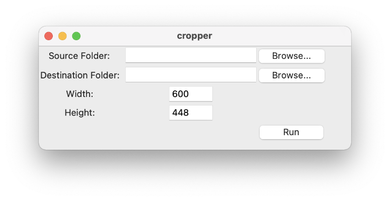

# inky-frame
This project contains a set of tools that can be used to display images on a *Pimoroni Inky Impression* e-ink display (or similar models).

## Preparing images

All images need to be cropped or expanded to the exact dimensions of the e-ink display first. This way, no important parts of the image will be cut off by automatic cropping. 

To speed up this process, `cropper.py` can be used. Launch it with 

    python cropper.py

After the initial setup, the script will open every image found in the source directory (and any of its subdirectories), and allow you to quickly adjust its size.

Every image can be either cropped:

Or expanded:

The controls are as follows:

| Key  | Switch to... | Function |
| ------------- | ------------- |  ------------- |
| Arrow keys  | Crop mode | Move the cropped area |
| W | Expand mode | Expand the image with white pixels |
| B | Expand mode | Expand the image with black pixels |
| Left click | Expand mode | Expand the image with the color selected by the mouse |
| Escape | - | Skip this image |
| Enter | - | Save the edited version to the destination folder |

## Displaying images

`show_image.py` can be used to display images on the e-ink display. All images must have the exact size of the e-ink display used.

A single image can be displayed by passing its path to the script:

    python show_image.py -p ~/Pictures/image.py

Pass the path of a folder to the script to display a random image out of the folder:

    python show_image.py -p ~/Pictures/

Cron could be used to display a different image every hour/day/week.
